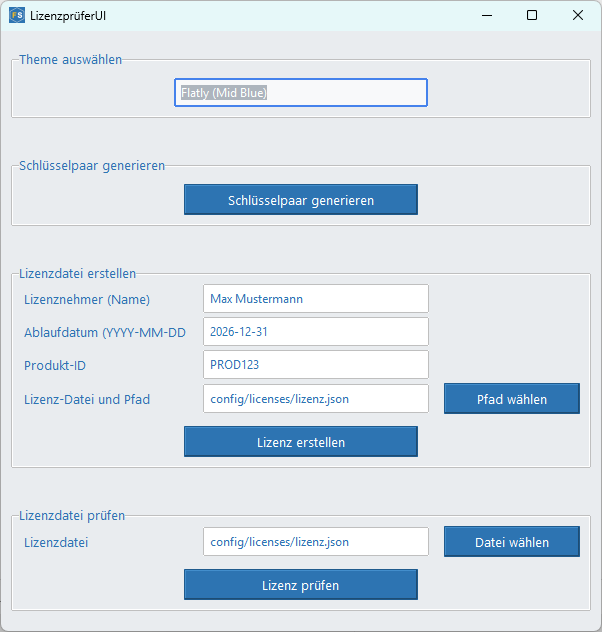

# LizenzprueferUI - Python-Anwendung in 23 Bootstrap-Designs

   

**LizenzprueferUI** ist ein Python-basiertes Lizenzprüfungssystem mit grafischer Benutzeroberfläche (GUI) und anpassbarem Theme-System.  
Diese Sammlung demonstriert **Bootstrap UI Design in Python** mit **23 einzigartigen Themes** – perfekt für **Python UI Layouts**, **Benutzeroberflächen-Design**, **Responsive Design** und **Python GUI Web**-Anwendungen.  
Neben klassischen `ttkbootstrap`-Themes sind auch exklusive **Bootstrap Themes** integriert, die modernes und konsistentes Design ermöglichen.

- 🔗 **[Live-Demo Viewer](https://franzsteinkress.github.io/LizenzprueferUI/html-visuals/index.html)**
- 🔗 **[Blogpost (DE/EN)](https://steinkress.com/blog.html#post10)**
- 🔗 **[GitHub Repository](https://github.com/franzsteinkress/LizenzprueferUI)**  


## Features

- **Lizenzprüfung** mit RSA-Signaturen (digitale Signaturprüfung mit `cryptography`)
- **23 Design-Themes** aus `ttkbootstrap` + individuelle **Custom Styles** (z. B. Glassmorphism, Neumorphism, Dark Neon Mode)
- **Responsive Design** für verschiedene Bildschirmgrößen
- **Visuelle Rückmeldungen** über MessageBox, Popups und Icons
- **Pfad- und Dateiauswahl** mit Voreinstellungen
- **Microsoft Segoe UI** als Standard-Schriftart

## Verfügbare Themes

| Nummer | Theme-Name | Schriftart | Theme-Kategorie |
| --- | ------------------- | --------- | ---------- | 
| 01 | Flatly (Material Design) | Segoe UI | ttkbootstrap Style |
| 02 | Flatly (Mid Blue) | Segoe UI | Custom Style |
| 03 | Journal (Minimal UI) | Segoe UI | ttkbootstrap Style |
| 04 | Cyborg (Dark Mode) | Segoe UI | ttkbootstrap Style |
| 05 | Vapor (Modern Flat) | Segoe UI | ttkbootstrap Style |
| 06 | Solar (Retro) | Segoe UI | ttkbootstrap Style |
| 07 | Superhero (Neo-Brutal) | Segoe UI | ttkbootstrap Style |
| 08 | Darkly (Dark Flat) | Segoe UI | ttkbootstrap Style |
| 09 | Litera (Clean Light) | Segoe UI | ttkbootstrap Style |
| 10 | Litera (Mid Blue) | Segoe UI | Custom Style |
| 11 | Lumen (Soft Light) | Segoe UI | ttkbootstrap Style |
| 12 | Cosmo (Modern Light) | Segoe UI | ttkbootstrap Style |
| 13 | Minty (Fresh Light) | Segoe UI | ttkbootstrap Style |
| 14 | Pulse (Vibrant) | Segoe UI | ttkbootstrap Style |
| 15 | United (Bold) | Segoe UI | ttkbootstrap Style |
| 16 | Yeti (Soft Blue) | Segoe UI | ttkbootstrap Style |
| 17 | Yeti (Mid Blue) | Segoe UI | Custom Style |
| 18 | Dark Neon Mode | Segoe UI | Custom Style |
| 19 | Glassmorphism | Segoe UI | Custom Style |
| 20 | Neumorphism | Segoe UI | Custom Style |
| 21 | Claymorphism | Segoe UI | Custom Style |
| 22 | Aurora Art Style | Segoe UI | Custom Style |
| 23 | Neo-Brutal (Gelb) | Segoe UI | Custom Style |

## Voraussetzungen

- Python **3.13.4** oder höher
- Bibliotheken:
  - `cryptography` – zur digitalen Signaturprüfung
  - `ttkbootstrap` – für moderne Themes und GUI-Komponenten
  - `Pillow` – für Icon-/Bildverarbeitung in der GUI

## Installation
1. Klone das Repository oder kopiere die Dateien.
   ```bash
   git clone https://github.com/franzsteinkress/LizenzprueferUI.git
   cd ./LizenzprueferUI
   ```
2. Stelle sicher, dass Python 3.13.4 installiert ist:
   ```bash
   python --version
   ```
3. Erstelle und aktiviere eine virtuelle Umgebung:
   ```bash
   python -m venv .venv
   .venv\Scripts\Activate.ps1
   ```
4. Installiere die Abhängigkeit:
   ```bash
   pip install cryptography pillow ttkbootstrap
   ```
5. Starte die Kommandozeilen-Anwendung:
   ```bash
   python lizenzpruefer.py --help
   ```

## Nutzung

### Kommandozeile

- **Schlüsselpaar generieren**:
   ```bash
   python lizenzpruefer.py --generiere-schluessel
   ```
- **Lizenzdatei erstellen**:
   ```bash
   python lizenzpruefer.py --erstelle-lizenz \
     --lizenznehmer "Max Mustermann" \
     --ablaufdatum "2026-12-31" \
     --produkt-id "PROD123" \
     --lizenz-datei config/licenses/lizenz.json
   ```
- **Lizenzdatei prüfen**:
   ```bash
   python lizenzpruefer.py --pruefe-lizenz --lizenz-datei config/licenses/lizenz.json
   ```
- **Ausgabe**:
   ```bash
   Die Ausgabe zeigt, ob die Lizenz gültig ist und gibt dann Lizenznehmer, Produkt-ID und Ablaufdatum aus.
   ```

### Grafische Benutzeroberfläche (GUI)

- **Virtuelle Umgebung aktivieren**:
   ```bash
   .venv\Scripts\Activate.ps1
   ```
- **GUI starten**:
   ```bash
   python lizenzprueferui.py
   ```
- **Voraussetzungen**:
   ```bash
   * Die Datei "fs.ico" muss im resources-Verzeichnis liegen
   * Styles werden automatisch erkannt
   ```

Die GUI ist vollständig mit [ttkbootstrap](https://ttkbootstrap.readthedocs.io/) gestaltet und in `lizenzpruefer_gui.py` implementiert. Sie hat eine intuitive, visuell anpassbare, grafische Benutzeroberfläche.

#### Eigenschaften

* Dynamische Theme-Auswahl
* Integration von benutzerdefinierten Styles (Custom Styles)
* Visuelle Rückmeldungen (MessageBox, Popups)
* Pfadauswahl für Lizenzdateien (mit Voreinstellungen)
* Unterstützung moderner GUI-Designs wie Glassmorphism und Neumorphism
* Verwendet die Microsoft-Schriftart "Segoe UI"

#### Funktionen

* **RSA-Schlüsselpaar generieren** 

* **Lizenzdatei erstellen**
  Eingabefelder für:

  * Lizenznehmer
  * Ablaufdatum (Format: `YYYY-MM-DD`)
  * Produkt-ID
  * Lizenzdatei-Zielpfad (voreingestellt, aber veränderbar)

* **Lizenz prüfen**
  Öffnet eine Datei, prüft die digitale Signatur und zeigt die Gültigkeit visuell an
* **Theme-Auswahl** (ttkbootstrap & Custom Styles)

* **Visuelle Rückmeldungen** bei gültigen/ungültigen Lizenzen

<!-- -->

## Hinweise Design & Theme-System

Die Anwendung unterstützt eine Vielzahl von Design-Themes aus `ttkbootstrap` und erweitert diese durch individuell gestaltete **Custom Styles** (z. B. Neon, Glass, Mid Blue). Diese  Designsysteme wie **Glasmorphism (transparente UI-Felder)** und **Neumorphism (weiche 3D-Effekte)** sind über das Theme-Auswahlmenü nutzbar.

Designauswahl im Code:

```python
from ttkbootstrap import Style
style = Style(theme="flatly")  # oder: "neon", "glass", etc.
```

In der GUI werden Custom Styles über `style.configure(...)` definiert, z. B.: Neon

```python
style.configure("neon.TButton",
    background="#00ff00",
    foreground="#000000",
    bordercolor="#00ff00",
    lightcolor="#00ff00",
    darkcolor="#00aa00",
    borderwidth=2,
    relief="flat"
)
```

## Lizenz
Die Anwendung ist unter der [MIT-Lizenz](./LICENSE) lizenziert.